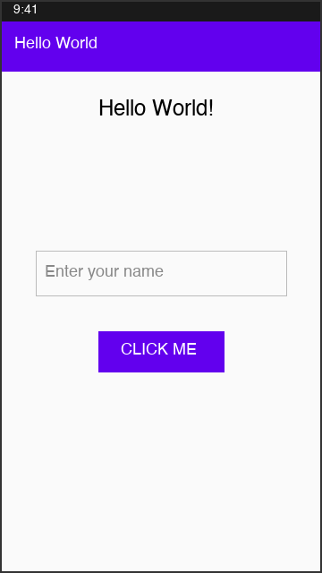

# Hello World Android App

## Description

This is a simple Android application that demonstrates basic user interaction in Android development. The app allows users to enter their name and receive a personalized greeting.

## Features

- Text input field for entering your name
- "Click Me" button to trigger the greeting
- Dynamic text display that updates with a personalized message

## How It Works

1. When the app launches, it displays "Hello World!" at the top of the screen
2. Enter your name in the text field labeled "Enter your name"
3. Tap the "Click Me" button
4. The display text changes to "Hi, [your name]"

## Technologies Used

- Kotlin
- Android SDK
- ConstraintLayout for UI design
- AndroidX AppCompat library

## Screenshot

## Getting Started

1. Clone this repository
2. Open the project in Android Studio
3. Run the app on an emulator or physical device

## Project Structure

- `MainActivity.kt` - Main activity handling user interactions
- `activity_main.xml` - Layout file defining the UI components
